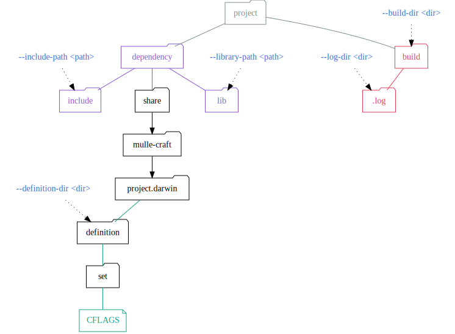
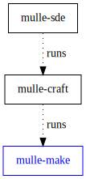

# 💄 Build projects with tools like cmake, meson, autoconf

... for Android, BSDs, Linux, macOS, SunOS, Windows (MinGW, WSL)

**mulle-make** will determine if the project needs to
be build via `configure`, `autoconf`, `cmake` or some other build tool.
It will then proceed to build the project using that tool.

| Release Version                                       | Release Notes
|-------------------------------------------------------|--------------
|  | [RELEASENOTES](RELEASENOTES.md) |


## What **mulle-make** does

Essentially, **mulle-make** does (for cmake projects):

``` sh
mkdir build
cd build
cmake ..
ninja
```

## Project structure

The next picture gives an overview of `mulle-make` default project structure
and how to customize it:




## Example

Here we use **mulle-make** in conjunction with [mulle-fetch](//github.com/mulle-sde/mulle-fetch) to conveniently download and build an autoconf based project:

``` sh
$ mulle-fetch https://ftp-stud.hs-esslingen.de/pub/Mirrors/ftp.gnu.org/bison/bison-3.5.4.tar.xz
Fetching bison from https://ftp-stud.hs-esslingen.de/pub/Mirrors/ftp.gnu.org/bison/bison-3.5.4.tar.xz.
$ cd bison/
$ mulle-make -lx
==> mkdir -p '/tmp/bison/build'
==> mkdir -p '/tmp/bison/build/.log'
=[29701]=> find -L '/tmp/bison' -maxdepth 2 -name CMakeLists.txt -print
=[29704]=> find -L '/tmp/bison' -maxdepth 2 -name meson.build -print
=[29707]=> find -L '/tmp/bison' -maxdepth 2 -name configure.ac -print
=[29711]=> find -L '/tmp/bison' -maxdepth 2 -name configure -print
Let configure do a Release build of bison for SDK Default in "build" ...
=[29722]=> cd '/tmp/bison/build'
=[29723]=> MULLE_MAKE_VERSION='0.14.4' __MULLE_MAKE_ENV_ARGS='': './configure'    >> /tmp/bison/build/.log/configure.log
=[35879]=> '/usr/bin/make'  VERBOSE=1 -j 40 all >> /tmp/bison/build/.log/make.log
$
```

You can look at the log output with

```sh 
$ mulle-make log 
```


## You are here




## Install

See [mulle-sde-developer](//github.com/mulle-sde/mulle-sde-developer) how to
install mulle-sde, which will also install mulle-make and required
dependencies.

The command to install only the latest mulle-make into
`/usr/local` (with **sudo**) is:

``` bash
curl -L 'https://github.com/mulle-sde/mulle-make/archive/latest.tar.gz' \
 | tar xfz - && cd 'mulle-make-latest' && sudo ./bin/installer /usr/local
```


## Author

[Nat!](https://mulle-kybernetik.com/weblog) for Mulle kybernetiK
