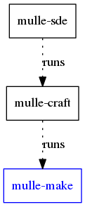
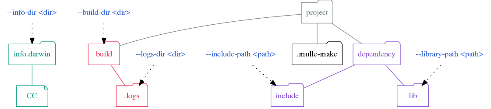

# mulle-make

🤖 Build projects uniformly with a variety of build systems


... for Linux, OS X, FreeBSD, Windows

**mulle-make** will determine if the project needs to
be build via `configure`, `autoconf`, `cmake` or some other build tool.
It will then proceed to build the project using that tool.




> For the sake of understandability, mulle-make does not evaluate any
> environment variables (such as CFLAGS) during construction of the 
> build tool arguments.
> Build settings are are either set with `info` directories or with
> commandline parameters.


Executable   | Description
-------------|--------------------------------
`mulle-make` | Build a single project


## Install

See [mulle-sde-developer](//github.com/mulle-sde/mulle-sde-developer) how
to install mulle-sde.


## What **mulle-make** does

Essentially, **mulle-make** does:

```
mkdir build
cd build
cmake ..
ninja
```

But it can do this for an expandable variety of build tools.


## Project structure

The next picture gives an overview of `mulle-make` default project structure
and how to customize it:




## GitHub and Mulle kybernetiK

The development is done on
[Mulle kybernetiK](https://www.mulle-kybernetik.com/software/git/mulle-make/master).
Releases and bug-tracking are on [GitHub](https://github.com/mulle-sde/mulle-make).
